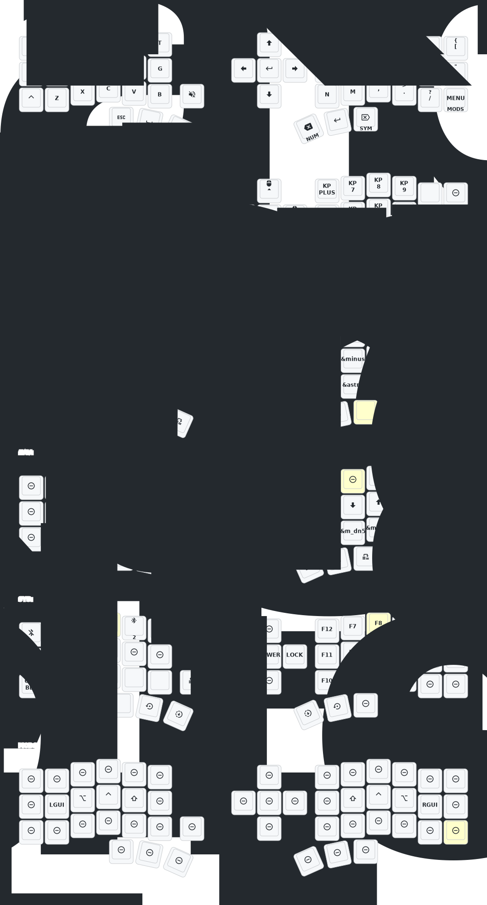

# ZMK для Corne

## От продавца девайса
**Важно**: Эта клавиатура **не является** стандартной Corne от [foostan](https://github.com/foostan/crkbd). Она не будет работать со стандартной прошивкой `corne`.

Если вам нужна 3D-модель этой клавиатуры, напишите на почту `380465425@qq.com`.

**Обновление от 22.08.2025**
- Добавлена функция Soft Off (глубокий сон). Чтобы перевести клавиатуру в спящий режим, зажмите одновременно клавиши **Q + S + Z** на 2 секунды. После этого клавиатура полностью отключится и не будет реагировать на нажатия. Чтобы вывести из спящего режима — нажмите кнопку Reset один раз.
- Оригинальный репозиторий: [тут](https://github.com/a741725193/zmk-new_corne)

---

## Основная концепция

Клавиатура использует **Home Row Mods** с защитой от ложных срабатываний что должно уменьшить их количество. Модификаторы срабатывают только тогда, когда удерживаемая клавиша прерывается нажатием на **противоположной стороне** клавиатуры (или большими пальцами). Благодаря этому можно быстро и уверенно набирать текст, не опасаясь случайных Ctrl, Alt, Shift или Win/Cmd.

## Слои клавиатуры

### 1. Layer 0 — QWERTY (основной слой)

Стандартная раскладка QWERTY с удобными модификаторами.

- На домашнем ряду расположены **Home Row Mods**:
  - Левая рука: `A` = Win/Cmd, `S` = Alt, `D` = Ctrl, `F` = Shift
  - Правая рука: `J` = Shift, `K` = Ctrl, `L` = Alt, `;` = Win/Cmd
- Модификаторы надёжно срабатывают только при кросс-хенд комбинациях (одна рука удерживает, вторая нажимает).
- Удержание `R` или `U` → переход на слой **NAV**
- Удержание `G` или `H` → переход на слой **SYM_2**
- Нижний ряд: быстрый доступ к `ESC`, `Space`, `Caps`, `Backspace`, `Enter` и `Delete`.

### 2. Layer 1 — NUM (цифры и математика)

Слой для комфортного ввода чисел в стиле калькулятора. Удобно работать с длинными числами, датами и математическими выражениями.

- **Левая половина** — обычные цифры и операторы (`+ - / * = .`)
- **Правая половина** — полноценный цифровой блок (NumPad)

### 3. Layer 2 — SYM (специальные символы)

Основной слой для ввода различных символов и пунктуации через unicode коды что в идеале должно обеспечить одинаковые символы вне зависимости от языковой раскладки.  
На данный момент не работает в русской раскладке для ОС windows. Для windows необходимо установить и запустить программу: `WinCompose`.

Слой разделён по удобству использования:
- **Левая половина** — адаптирована под программистские нужды и содержит парные символы
- **Правая половина** — остальные символы

### 4. Layer 3 — NAV (навигация и мышь)

Универсальный слой для навигации.
- **Левая половина** — управление мышью:
  - Движение курсора во все стороны
  - Кнопки мыши (левый, средний, правый клик, prev, next)

- **Правая половина** — навигация по тексту:
  - Стрелки в стиле Vim (`H J K L`)
  - Выше vim кнопок,  передвижение сразу на 10 позиции
  - Ниже vim кнопок, передвижение сразу на 5 позиции
  - `Page Up`, `Page Down`, `Home`, `End`

### 5. Layer 4 — SYS (системный слой)

Слой для системных функций и настроек клавиатуры.

- **Левая половина**:
  - Управление Bluetooth (выбор профилей, очистка)
  - Переключение между Bluetooth и USB
  - Переключение режима Unicode (Linux / Windows)

- **Правая половина**:
  - Все F-клавиши (F1–F12)
  - Системные команды: Sleep, Power, Lock на джойстике
  - Системные команды: Insert, Print Screen

### 6. Layer 5 — SYM_2 (альтернативные символы)

Дополнительный слой символов с двумя важными задачами:

- Удобный ввод часто используемых символов в привычном порядке
- Fallback-режим, если устройство не поддерживает режим ввода Unicode символов

Особенности:
- Верхний и правый ряды содержат популярные символы (`~ ! @ # $ % ^ & * ( ) _ + =` и др.)
- Дублирует клавиши `H J K L` для перемещения курсора (удобно, когда Home Row Mods мешают)
- Нижний ряд — HTML-entities: `&lt;`, `&gt;`, `&amp;`, `&quot;`, `&nbsp;`, `&ensp;`, `&emsp;`, `&copy;`, `&euro;` и другие полезные последовательности для веб-разметки.

## Рекомендации по использованию

- **Повседневный набор** — основной слой QWERTY (Layer 0). Home Row Mods должен работать относительно надёжно, но потребует привыкания. Клавиши нужно научиться нажимать "хлестко".
- **Цифры** — используйте Layer 1.
- **Символы** — сначала пробуйте Layer 2 (SYM). Если unicode не поддерживается — переходите на Layer 5 (SYM_2). Не забудьте установить необходимый режим операционной системы (linux & windows). Режим по умолчению linux.
- **Навигация и мышь** — Layer 3 (NAV).
- **Системные функции** — Layer 4 (SYS).
- **Альтернативные символы** — Layer 5 (SYM_2). Unicode символы не поддерживаются в vim normal mode, для этих целей используйте символы с верхнего и правого ряда данного слоя. 

---

## Схема раскладки (Keymap Diagram)

